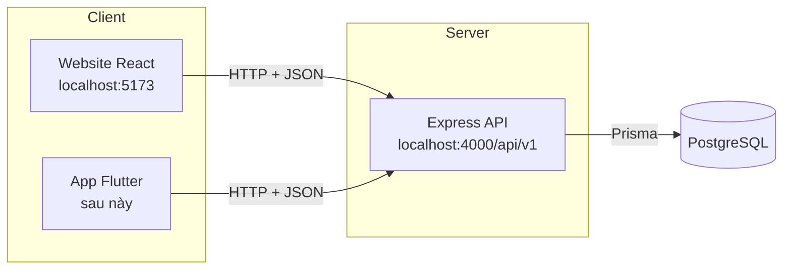
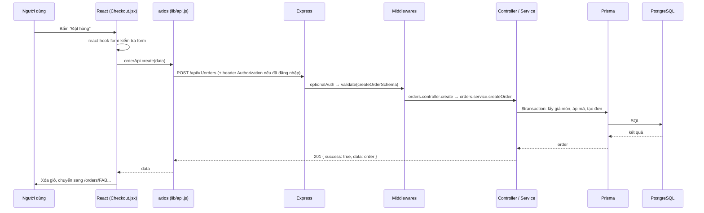

# 01. Tổng quan & kiến trúc

## 1. Bức tranh tổng thể

Dự án theo mô hình **client - server** và tách thành 3 phần độc lập:



- **Frontend (React)** chỉ lo hiển thị và tương tác. Nó không kết nối thẳng vào database.
- **Backend (Express)** nhận request, kiểm tra quyền, kiểm tra dữ liệu, xử lý nghiệp vụ (tính tiền, áp mã giảm giá...), đọc/ghi DB rồi trả về JSON.
- **Database (PostgreSQL)** lưu trữ dữ liệu.

👉 Nhờ tách riêng như vậy, **app Flutter chỉ cần gọi đúng các API mà web đang dùng**, không phải viết lại backend.

## 2. Một request đi qua những đâu?

Ví dụ: khách bấm **"Đặt hàng"** ở trang Thanh toán.



Đọc code theo đúng thứ tự trên là cách nhanh nhất để hiểu dự án:
`frontend/src/pages/Checkout.jsx` → `frontend/src/services/index.js` → `backend/src/modules/orders/orders.routes.js` → `orders.controller.js` → `orders.service.js`.

## 3. Vì sao chọn các công nghệ này?

| Công nghệ | Vai trò | Lý do chọn |
|---|---|---|
| **React 19** | Thư viện UI | Phổ biến nhất, nhiều việc làm, cộng đồng lớn |
| **Vite** | Công cụ build/dev server | Khởi động gần như tức thì, thay thế Create React App (đã ngừng phát triển) |
| **Tailwind CSS v4** | Styling | Viết style ngay trong JSX, không phải đặt tên class, giao diện đồng bộ |
| **React Router 7** | Điều hướng trang | Chuẩn de-facto cho SPA |
| **TanStack Query** | Quản lý dữ liệu từ server | Tự lo loading/error/cache/refetch, không cần tự viết `useEffect` + `useState` |
| **Zustand** | State phía client (giỏ hàng, đăng nhập) | Gọn hơn Redux rất nhiều, có sẵn `persist` lưu localStorage |
| **React Hook Form** | Form | Ít render lại, kiểm tra dữ liệu dễ |
| **Express 5** | Web framework Node.js | Đơn giản, dễ học. Bản 5 tự bắt lỗi của hàm async |
| **Prisma** | ORM | Viết truy vấn bằng JS thay vì SQL, có migration, gợi ý code tốt |
| **PostgreSQL** | CSDL quan hệ | Mạnh, miễn phí, hợp với dữ liệu có quan hệ chặt (đơn - món - người dùng) |
| **Zod** | Kiểm tra dữ liệu đầu vào | Khai báo schema ngắn gọn, thông báo lỗi tiếng Việt tùy chỉnh |
| **JWT** | Xác thực | Không cần session, hợp cho cả web lẫn mobile |

## 4. Nguyên tắc thiết kế quan trọng

1. **Không bao giờ tin dữ liệu từ client.** Giỏ hàng gửi lên chỉ gồm `dishId` và `quantity`. Giá món do backend đọc từ DB. Nếu tin giá client gửi, người dùng có thể sửa request để mua tôm hùm giá 1đ.
2. **Kiểm tra dữ liệu ở cả hai phía.** Frontend kiểm tra để báo lỗi nhanh cho người dùng (UX). Backend kiểm tra để bảo mật. Kiểm tra ở frontend có thể bị bỏ qua dễ dàng.
3. **Một định dạng response duy nhất:**
   ```json
   { "success": true, "data": ..., "meta": { "page": 1, "totalPages": 3 } }
   { "success": false, "message": "Thông báo lỗi", "errors": [{ "field": "phone", "message": "..." }] }
   ```
   Nhờ vậy frontend và app Flutter xử lý lỗi theo một cách thống nhất.
4. **Lưu "ảnh chụp" dữ liệu tại thời điểm giao dịch.** `OrderItem` lưu lại `name` và `price` lúc đặt hàng. Sau này món có đổi giá thì đơn cũ vẫn đúng.
5. **Trạng thái đơn hàng là một state machine.** Đơn chỉ được chuyển theo các bước hợp lệ (xem `STATUS_FLOW` trong `orders.service.js`). Không thể nhảy thẳng từ "Chờ xác nhận" sang "Hoàn thành".
6. **Dùng transaction cho thao tác nhiều bước.** Tạo đơn = tạo order + tạo items + tăng lượt dùng mã + tăng số lượng đã bán. Nếu một bước lỗi thì tất cả được hoàn tác.

## 5. Phân quyền

| Vai trò | Quyền |
|---|---|
| Khách vãng lai | Xem menu, đặt món, đặt bàn, tra cứu đơn bằng mã đơn + SĐT |
| CUSTOMER (đã đăng nhập) | Thêm: lịch sử đơn và đặt bàn, sửa hồ sơ, đánh giá món |
| ADMIN | Toàn bộ trang `/admin` và các API quản trị |

Ở backend, phân quyền được thực hiện bằng các middleware `requireAuth`, `optionalAuth`, `requireAdmin` (`backend/src/middlewares/auth.js`).
Ở frontend, component `ProtectedRoute` chặn người chưa đăng nhập hoặc không đúng vai trò. **Lưu ý:** việc chặn ở frontend chỉ để có trải nghiệm tốt. Bảo mật thật nằm ở backend.
