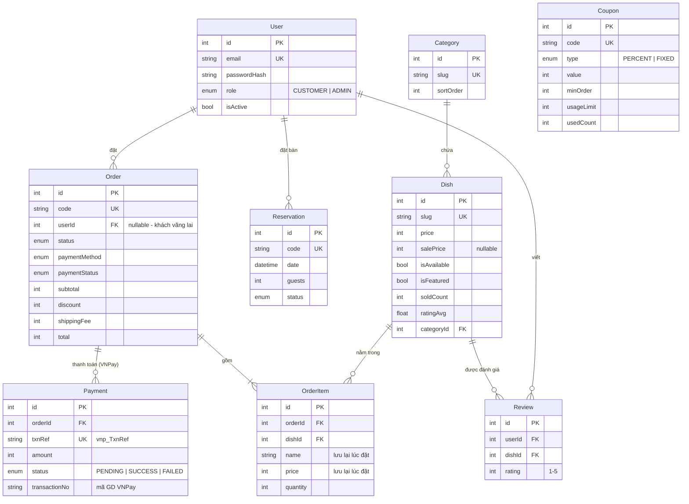

# 03. Database & Prisma

## 1. Sơ đồ quan hệ (ERD)



File gốc: `backend/prisma/schema.prisma`

## 2. Giải thích các quyết định thiết kế

| Quyết định | Lý do |
|---|---|
| Giá lưu dạng **Int (VNĐ)** thay vì Float | Số thực bị sai số (`0.1 + 0.2 = 0.30000000000000004`). Tiền Việt không có phần lẻ nên dùng số nguyên là an toàn nhất |
| `Order.userId` cho phép **null** | Khách không cần tài khoản vẫn đặt hàng được (tăng tỉ lệ chốt đơn) |
| `OrderItem` lưu `name`, `price` | "Ảnh chụp" tại thời điểm mua, món đổi giá sau đó thì đơn cũ vẫn đúng |
| `Order.code` riêng ngoài `id` | Không lộ `id` tăng dần (người khác có thể đoán ra số đơn của quán). Mã như `FAB261001123456` cũng dễ đọc qua điện thoại hơn |
| `Dish.soldCount`, `ratingAvg`, `ratingCount` | **Denormalization**: lưu sẵn giá trị tổng hợp để sắp xếp và hiển thị nhanh, không phải tính lại mỗi lần đọc. Đổi lại, phải cập nhật mỗi khi có đơn hoặc đánh giá mới |
| `@@unique([userId, dishId])` ở Review | Mỗi người chỉ đánh giá một món một lần (đánh giá lại thì cập nhật bản cũ) |
| `slug` | URL đẹp, tốt cho SEO: `/menu/tom-su-hap-bia` thay vì `/menu/4` |
| `@@index` | Tăng tốc truy vấn hay dùng: lọc đơn theo `status`, `createdAt`, lọc món theo `categoryId` |
| `onDelete: Cascade` ở OrderItem | Xóa đơn thì các dòng chi tiết bị xóa theo |
| Bảng `Payment` riêng, không chỉ dùng `Order.paymentStatus` | Một đơn có thể thanh toán nhiều lần (hủy rồi trả lại). Mỗi lần là một dòng, lưu mã giao dịch VNPay để đối soát khi có khiếu nại. `Order.paymentStatus` vẫn giữ để hiển thị và lọc nhanh. Xem [11](11-thanh-toan-vnpay.md) |

## 3. Prisma cơ bản

### Migration: thay đổi cấu trúc DB
1. Sửa `schema.prisma`, ví dụ thêm cột `calories Int?` vào `Dish`.
2. Chạy `npm run db:migrate`. Prisma hỏi tên migration, ví dụ nhập `add_calories`.
3. Prisma tạo file SQL trong `prisma/migrations/`, chạy file đó vào DB và generate lại client.

> Migration là **lịch sử thay đổi DB**, hãy commit cả thư mục `migrations/` lên git. Người khác chỉ cần chạy `prisma migrate dev` là có DB giống bạn.

### Truy vấn thường dùng

```js
// Lấy danh sách có điều kiện, sắp xếp, phân trang
prisma.dish.findMany({
  where: { isAvailable: true, name: { contains: 'tôm', mode: 'insensitive' } },
  orderBy: { soldCount: 'desc' },
  skip: 0,
  take: 12,
  include: { category: true },     // JOIN lấy kèm danh mục
});

// Lấy 1 bản ghi theo trường unique
prisma.dish.findUnique({ where: { slug: 'tom-su-hap-bia' } });

// Tạo kèm bản ghi con (nested create)
prisma.order.create({ data: { ..., items: { create: [{ dishId: 1, quantity: 2, ... }] } } });

// Cập nhật tăng/giảm
prisma.dish.update({ where: { id: 1 }, data: { soldCount: { increment: 2 } } });

// Đếm, tổng hợp, group by
prisma.order.aggregate({ where: { status: 'COMPLETED' }, _sum: { total: true } });
prisma.order.groupBy({ by: ['status'], _count: { _all: true } });

// SQL thuần khi Prisma không đủ (xem stats.controller.js)
prisma.$queryRaw`SELECT ... WHERE "createdAt" >= ${since}`;  // tham số tự động được escape → chống SQL injection
```

### Transaction

```js
// Kiểu 1: mảng các truy vấn độc lập, chạy cùng lúc
const [items, total] = await prisma.$transaction([
  prisma.dish.findMany({ where }),
  prisma.dish.count({ where }),
]);

// Kiểu 2: hàm callback cho logic nhiều bước phụ thuộc nhau (xem orders.service.js)
await prisma.$transaction(async (tx) => {
  const dishes = await tx.dish.findMany(...);
  if (...) throw ApiError.badRequest('...');   // throw → toàn bộ được rollback
  await tx.order.create(...);
});
```

## 4. Công cụ xem dữ liệu

- `npm run db:studio`: giao diện web của Prisma
- **DBeaver** hoặc **pgAdmin**: client SQL đầy đủ tính năng
- Dòng lệnh: `psql fab_restaurant`, sau đó `\dt` để xem bảng, `SELECT * FROM "Dish" LIMIT 5;`

> Prisma đặt tên bảng theo tên model nên có chữ hoa. Trong SQL thuần phải đặt trong ngoặc kép: `"Order"`, `"createdAt"`.

## 5. Tự luyện tập

1. Viết truy vấn Prisma lấy 5 khách hàng chi tiêu nhiều nhất (gợi ý: `groupBy` theo `userId`, `_sum.total`).
2. Thêm model `Table` (bàn: số bàn, sức chứa, khu vực) và liên kết với `Reservation`.
3. Mở Prisma Studio và tự tạo một món mới, rồi kiểm tra món đó trên website.
