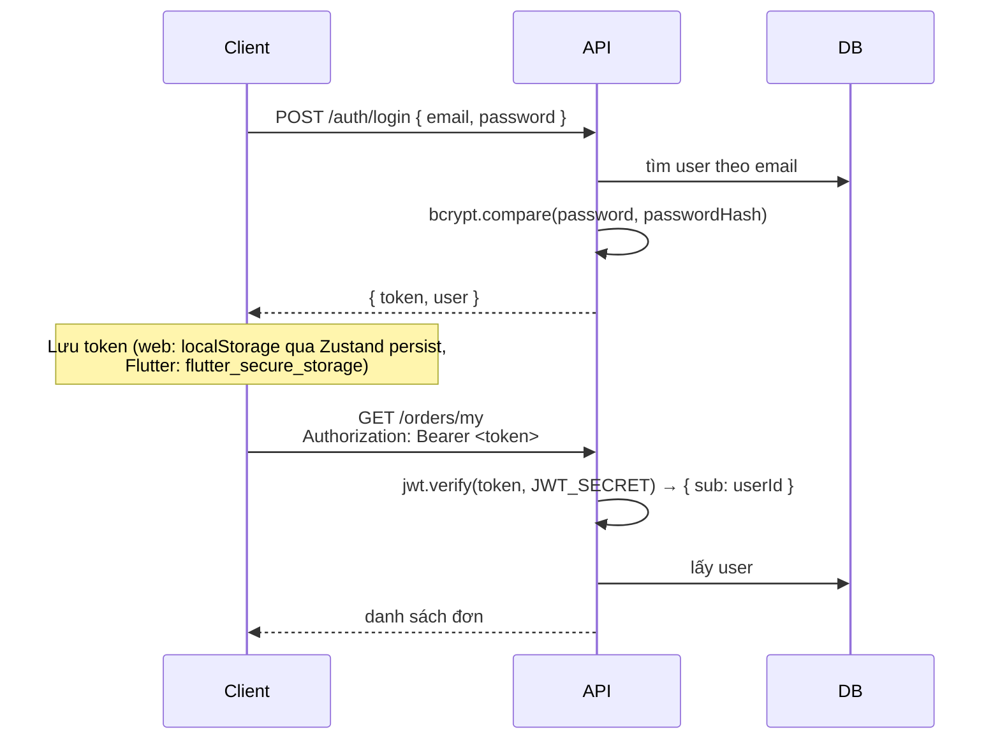

# 04. Backend với Express

## 1. Cấu trúc theo module

Mỗi chức năng (feature) nằm trong một thư mục riêng ở `src/modules/`:

```
modules/orders/
├── orders.routes.js      # Khai báo URL + middleware nào chạy trước
├── orders.validation.js  # Schema Zod kiểm tra dữ liệu gửi lên
├── orders.controller.js  # Nhận req, gọi service/prisma, trả res
└── orders.service.js     # Logic nghiệp vụ phức tạp (tính tiền, state machine)
```

| Tầng | Trách nhiệm | KHÔNG nên làm |
|---|---|---|
| routes | Nối URL → middleware → controller | Chứa logic |
| validation | Định nghĩa dữ liệu hợp lệ | Truy vấn DB |
| controller | Đọc `req`, trả `res` | Logic quá dài (nên tách sang service) |
| service | Nghiệp vụ, có thể dùng lại ở nhiều nơi | Đụng tới `req` / `res` |

Module đơn giản (categories, users...) không cần service, controller gọi thẳng Prisma. **Đừng tạo tầng thừa** khi chưa cần.

## 2. Vòng đời một request

```
Request
  → helmet()            thêm header bảo mật
  → cors()              cho phép frontend ở domain khác gọi
  → express.json()      đọc body JSON thành req.body
  → morgan()            log request ra console
  → /api/v1 router (routes.js)
      → /orders router (orders.routes.js)
          → optionalAuth    đọc token nếu có → req.user
          → validate(schema) kiểm tra req.body
          → controller      xử lý, res.json(...)
  → notFoundHandler     không route nào khớp → 404
  → errorHandler        mọi lỗi throw ở trên đều chạy vào đây
```

**Middleware** là hàm `(req, res, next) => {}`. Gọi `next()` để chuyển sang middleware kế tiếp, hoặc `throw` / `next(err)` để nhảy thẳng tới `errorHandler`.

## 3. Xác thực bằng JWT



Các điểm cần nắm:
- **Mật khẩu không bao giờ lưu dạng gốc.** `bcrypt.hash(password, 10)` tạo chuỗi băm có salt. Khi đăng nhập dùng `bcrypt.compare`.
- **JWT gồm 3 phần** `header.payload.signature`. Payload **chỉ được mã hóa base64, KHÔNG được bảo mật**. Ai cũng đọc được, nên đừng bỏ thông tin nhạy cảm vào đó. Chữ ký giúp server biết token không bị sửa.
- Đăng nhập sai thì luôn trả cùng một thông báo "Email hoặc mật khẩu không đúng" để kẻ xấu không dò được email nào đã đăng ký.
- Middleware trong `src/middlewares/auth.js`:
  - `requireAuth`: bắt buộc đăng nhập
  - `optionalAuth`: có token thì gắn `req.user`, không có cũng được
  - `requireRole('ADMIN')` / `requireAdmin`: kiểm tra vai trò

## 4. Kiểm tra dữ liệu với Zod

```js
// orders.validation.js
export const createOrderSchema = z.object({
  phone: z.string().regex(/^(0|\+84)\d{9,10}$/, 'Số điện thoại không hợp lệ'),
  type: z.enum(['DELIVERY', 'PICKUP']).default('DELIVERY'),
  items: z.array(z.object({ dishId: z.coerce.number().int(), quantity: z.coerce.number().min(1) })).min(1),
}).refine((o) => o.type !== 'DELIVERY' || o.address, { message: 'Vui lòng nhập địa chỉ', path: ['address'] });
```

- `z.coerce.number()` ép `"5"` thành `5` (hữu ích với query string và form)
- `.default()` gán giá trị mặc định
- `.refine()` dùng cho điều kiện liên quan tới nhiều trường
- Middleware `validate(schema)` gọi `schema.safeParse(req.body)`. Lỗi thì trả 400 kèm danh sách `errors`. Hợp lệ thì thay `req.body` bằng dữ liệu đã làm sạch (các trường thừa bị loại bỏ).

## 5. Xử lý lỗi tập trung

```js
// Ở bất kỳ đâu trong controller/service:
throw ApiError.notFound('Không tìm thấy món ăn');
throw ApiError.badRequest('Mã giảm giá đã hết hạn');
```

`errorHandler` (`src/middlewares/error.js`) bắt mọi lỗi và trả JSON thống nhất. Nó cũng tự chuyển lỗi của Prisma sang thông báo dễ hiểu:
- `P2002` (trùng unique) → 409 "Giá trị ... đã tồn tại"
- `P2025` (không tìm thấy bản ghi khi update/delete) → 404

> **Express 5** tự bắt lỗi từ hàm `async`. Ở Express 4 bạn phải bọc mọi controller bằng `try/catch` hoặc `asyncHandler`. Bạn sẽ thấy cách này trong nhiều tutorial cũ.

## 6. Logic nghiệp vụ đáng đọc kỹ

### 6.1 Tạo đơn hàng: `orders.service.js > createOrder`
1. Gộp các dòng trùng món.
2. Lấy giá **từ DB** (bỏ qua giá client gửi), kiểm tra món còn bán.
3. Tính `subtotal`, phí ship (miễn phí nếu ≥ `FREE_SHIPPING_MIN` hoặc khách đến lấy).
4. Áp mã giảm giá (`coupons.service.js > applyCoupon`): kiểm tra hạn dùng, số lượt còn lại, đơn tối thiểu, mức giảm tối đa.
5. Tạo order + items, tăng `usedCount` của mã và `soldCount` của món.
6. Tất cả nằm trong **một transaction**.

### 6.2 State machine trạng thái đơn
```
PENDING ──► CONFIRMED ──► PREPARING ──► DELIVERING ──► COMPLETED
   │            │             │  └──────────────────────►  ▲
   └────────────┴─────────────┴──────► CANCELLED           │ (PICKUP bỏ qua DELIVERING)
```
- Hoàn thành đơn COD → tự đánh dấu `PAID`
- Hủy đơn đã thanh toán → `REFUNDED`. Đồng thời trả lại `soldCount` và lượt dùng mã

### 6.3 Thanh toán mô phỏng
`POST /orders/:code/pay` đánh dấu `PAID` ngay. Với cổng thanh toán thật (VNPay/MoMo), luồng sẽ là:
1. Backend tạo URL thanh toán có chữ ký, trả về cho client.
2. Client chuyển hướng người dùng sang trang của VNPay.
3. VNPay gọi **IPN** (webhook) về backend. Backend kiểm tra chữ ký rồi mới cập nhật `PAID`.
4. VNPay chuyển hướng người dùng về trang kết quả.

## 7. Hướng dẫn: thêm một module mới

Ví dụ: module **Liên hệ** (khách gửi góp ý).

**B1. Thêm model** vào `schema.prisma`:
```prisma
model Contact {
  id        Int      @id @default(autoincrement())
  name      String
  email     String
  message   String
  isRead    Boolean  @default(false)
  createdAt DateTime @default(now())
}
```
Chạy `npm run db:migrate` và đặt tên migration là `add_contact`.

**B2. Tạo** `src/modules/contacts/contacts.routes.js`:
```js
import { Router } from 'express';
import { z } from 'zod';
import { prisma } from '../../lib/prisma.js';
import { requireAdmin } from '../../middlewares/auth.js';
import { validate } from '../../middlewares/validate.js';

const contactSchema = z.object({
  name: z.string().trim().min(2),
  email: z.email(),
  message: z.string().trim().min(10).max(2000),
});

const router = Router();

router.post('/', validate(contactSchema), async (req, res) => {
  const contact = await prisma.contact.create({ data: req.body });
  res.status(201).json({ success: true, data: contact });
});

router.get('/', requireAdmin, async (req, res) => {
  const contacts = await prisma.contact.findMany({ orderBy: { createdAt: 'desc' } });
  res.json({ success: true, data: contacts });
});

export default router;
```

**B3. Gắn vào** `src/routes.js`:
```js
import contactRoutes from './modules/contacts/contacts.routes.js';
router.use('/contacts', contactRoutes);
```

**B4. Thử** bằng `docs/api.http` hoặc Postman. Tiếp theo làm frontend: thêm hàm vào `services/index.js`, tạo trang và thêm route trong `App.jsx`.

## 8. Bảo mật đã áp dụng & còn thiếu

✅ Đã có: bcrypt, JWT, phân quyền, validation, helmet, CORS giới hạn domain, giới hạn kích thước body/file, chỉ nhận đúng loại file ảnh, Prisma chống SQL injection, không lộ `passwordHash`, không lộ stack trace khi chạy production.

⏳ Nên bổ sung khi chạy thật (bài tập):
- **Rate limit** (`express-rate-limit`) cho `/auth/login` để chống dò mật khẩu
- Refresh token và thu hồi token
- Xác thực email, quên mật khẩu
- Log ra file và giám sát lỗi (Sentry)
